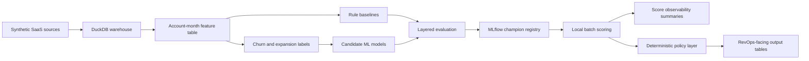

# Architecture

## Status

This document describes the implemented local batch architecture after Package
11. The repository is synthetic-only, local-first, and batch-oriented. It does
not implement dashboards, hosted APIs, cloud deployment, campaign execution, or
production monitoring.

## Implemented Flow

## Layers

### Synthetic SaaS Sources

Package 1 generates deterministic synthetic source tables for
accounts, users, usage events, subscriptions, invoices, support tickets, CRM
touchpoints, and renewals. The source layer is intentionally synthetic so the
public repository can demonstrate production-style workflows without committing
private records.

### DuckDB Warehouse

DuckDB is the local analytical warehouse. It provides reproducible SQL-friendly
storage for generated source tables, validated contracts, feature queries,
labels, scoring snapshots, and local output tables. DuckDB database files remain
generated artefacts and must not be committed.

### Account-Month Feature Table

The core modeling table has one row per account per snapshot month. Features
summarize account lifecycle, usage, adoption, billing, support, CRM activity,
renewal proximity, and segment attributes using only information available as of
the snapshot date.

### Labels

Labels are derived from future windows after each snapshot month. Churn and
expansion labels stay independent so that each commercial outcome can be
trained, evaluated, and reviewed separately.

### Rule Baselines

Before ML models are accepted, the project creates credible commercial rule
baselines. Baselines are necessary because a production-style system should show
that ML improves on simple, explainable operating heuristics.

### Candidate ML Models

Candidate churn and expansion models are trained from the account-month table.
The implementation uses global models with segment evaluation, rather than
separate models per segment.

### Layered Evaluation

Evaluation includes fixed time splits, holdout-month temporal robustness slices,
baseline-versus-ML comparisons, top-K capacity metrics, illustrative utility
sensitivity, calibration checks, and segment robustness checks. Full rolling
retraining backtests are intentionally not implemented.

### MLflow Champion Registry

MLflow tracks local experiments, logs artefacts, and loads champion churn and
expansion models by registry alias after Package 6 selection and Package 7
promotion. Champion selection uses operating metrics, not ROC AUC alone.

### Batch Scoring

Scoring runs as a local batch job. It loads one explicit account-month
population, validates the feature contract, loads champion models, produces
separate churn and expansion scores, and writes local outputs plus audit
metadata.

### Deterministic Policy Layer

The policy layer converts scores into account health bands and recommended GTM
actions. These outputs are deterministic illustrative rules layered on top of
model scores, not standalone trained targets.

### RevOps-Facing Outputs

The final batch outputs are readable by GTM operators. The main reviewer-facing
tables are:

- `mart.account_month_scores`
- `mart.score_observability_summary`
- `mart.account_month_gtm_policy`

### Score Observability Summaries

Package 9 observability is local and artefact-based. It inspects raw Package 8
score outputs, summarizes score distributions and safe segment slices, records
observed scoring lineage, and compares scored months when history exists. It is
not real production drift detection or automated model governance. Generated
observability outputs stay out of git.
