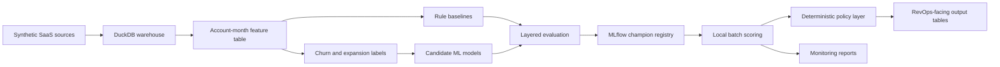

# Architecture

## Status

This document describes the intended local batch architecture. Package 0 does
not implement data generation, DuckDB, MLflow, modeling, scoring, dashboards, or
monitoring outputs.

## Intended Flow

## Layers

### Synthetic SaaS Sources

Future packages will generate deterministic synthetic source tables for
accounts, users, usage events, subscriptions, invoices, support tickets, CRM
touchpoints, and renewals. The source layer is intentionally synthetic so the
public repository can demonstrate production-style workflows without committing
private records.

### DuckDB Warehouse

DuckDB is the planned local analytical warehouse. It will provide reproducible
SQL-friendly storage for generated source tables, validated contracts, feature
queries, labels, scoring snapshots, and local output tables. DuckDB database
files will remain generated artefacts and should not be committed.

### Account-Month Feature Table

The core modeling table will have one row per account per snapshot month.
Features will summarize account lifecycle, usage, adoption, billing, support,
CRM activity, renewal proximity, and segment attributes using only information
available as of the snapshot date.

### Labels

Labels will be derived from future windows after each snapshot month. Churn and
expansion labels will be independent so that each commercial outcome can be
trained, evaluated, calibrated, and thresholded separately.

### Rule Baselines

Before ML models are accepted, the project will create credible commercial rule
baselines. Baselines are necessary because a production-style system should show
that ML improves on simple, explainable operating heuristics.

### Candidate ML Models

Candidate churn and expansion models will be trained from the account-month
table. The intended approach uses global models with segment evaluation, rather
than separate models per segment.

### Layered Evaluation

Evaluation will include fixed time splits, rolling monthly backtests,
baseline-versus-ML comparisons, top-K capacity metrics, economic utility
sensitivity, calibration checks, and segment robustness checks.

### MLflow Champion Registry

MLflow is planned for later packages to track experiments, log artefacts, and
load champion churn and expansion models by registry alias. Champion selection
will use operating metrics, not ROC AUC alone.

### Batch Scoring

Scoring is planned as a local batch job. It will load the latest account-month
snapshot, validate the feature contract, load champion models, produce churn and
expansion scores, and write local outputs.

### Deterministic Policy Layer

The policy layer will convert scores into account health bands and recommended
GTM actions. These outputs are deterministic business rules layered on top of
model scores, not standalone trained targets.

### RevOps-Facing Outputs

The final batch outputs should be readable by GTM operators. Planned output
tables include account-level scores, health bands, recommended actions, segment
fields, threshold metadata, and scoring run metadata.

### Monitoring Reports

Monitoring will be local and artefact-based. Future reports should cover data
quality, feature drift, prediction drift, recommendation volumes, and capacity
warnings. Generated monitoring outputs should stay out of git unless a later
package explicitly approves safe examples.
